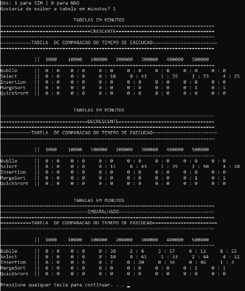

**UNIVERSIDADE FEDERAL DE MATO GROSO DO SUL** **FACULDADE DE COMPUTAÇÃO** 

**ALGORITOMOS E PROGRAMAÇÃO II** 

EDUARDO ATENE SILVA 

` `**Relatório de tempo de execução dos algoritmos de ordenação** 

Campo Grande 2020 

**Introdução** 

Está dissertação ilustra os tempos de execução dos algoritmos de ordenação: Bubble Sort, Select Sort, Insection Sort, Marge Sort e Quick Sort. Para isso, foi criado um algoritmo que irá testar cada algoritmo de ordenação e irá calcular o tempo de execução, gerando tabela para demonstras os casos. Os testes serão feitos por meio de vetores alocados dinamicamente com os respectivos tamanhos. 

Ao decorrer deste relatório, será apresentado uma discussão referente à saída 

produzida.  

**Relatório** 

De acordo com os tempos de execução dos algoritmos de ordenação: Bubble Sort, Select Sort, Insection Sort, Marge Sort e Quick Sort. Para isso, foi craido e executado um programa que irá testar cada algoritmo e irá calcular o tempo de execução. Para os testes foram gerados  vetores  alocados  dinamicamente  com  os  respectivos  tamanhos:  1,000;  10,000; 100,000; 200,000; 300,000; 400,000; 500,000. Os vetores foram ordenados de forma crescente, decrescente e embaralhado. Para embaralhar o vetor, foi solicitado o algoritmo Fisher Yates. Esse  algoritmo  irá  gerar  uma  permutação  aleatória,  ou  seja,  embaralhar  o  vetor.  Para embaralhar o vetor, foi usado a função *rand()*,* da biblioteca *stdlib.h,*, que foi usada para sortear um número para embaralhar o vetor. 

Os algoritmos de ordenação irão ordenar os vetores de forma crescente. Mais por que ordenar um vetor crescente que já está ordenado? Iremos ordenar este vetor para medir o tempo de execução de um vetor que já está ordenado.  

**Saída do tempo de execução dos algoritmos** 

Como  já  dito,  os  vetores  foram  gerados  de  forma  crescente,  decrescente  e embaralhados. Neste tópico, vamos discutir sobre as saídas produzida e debater qual é o algoritmo mais eficiente, de acordo com cada saída. 

**Vetores crescente:** 

Imagem 1: Tabela referente a saída produzida no algoritmo. 

Imagem 2: Gráfico referente a saída produzida da Imagem 1.  

Está nitidamente  explicito que o algoritmo  Select Sort demandou mais tempo em vetores  já  ordenados.   Já  o  Marge  Sorte,  teve  um  tempo  entre  0  e  2  segundos  para verificar/ordenar os valores. Já os outros algoritmos, em vetor crescente, o tempo de execução nestes foi quase nulo. 

**Vetores decrescente:** 

Imagem 3: Tabela referente a saída produzida no algoritmo. 

Imagem 4: Gráfico referente a saída produzida da Imagem 3. 

Novamente, o algoritmo Select Sort demandou mais tempo de execução comparado com os outros algoritmos. Já o Marge Sorte, teve um tempo entre 0 e 1.860 segundos para verificar/ordenar  os  valores.  Já  os  outros  algoritmos,  em  vetor  decrescente,  o  tempo  de execução, novamente, foi quase nulo em todos os tamanhos dos vetores. 

**Vetores embaralhado:** 

Imagem 5: Tabela referente a saída produzida no algoritmo. 

Imagem 6: Gráfico referente a saída produzida da Imagem 5. 

Neste  caso  de  teste,  o  algoritmo  que  demandou  mais  tempo  foi  o  Bubble  Sort, principalmente com vetores com grande quantidade de dados. Em segundo, foi o Select, que teve a metade do tempo do Bubble e também demonstro pouco eficientes para vetores grandes. Logo em seguida, vem o algoritmo Insertion, que demonstro mais eficiente que o Bubble e o Select.  Os  algoritmos  que  demonstro  mais  eficiente  em  vetores  embaralhados  foram  os algoritmos Marge Sort e Quick Sort. O Quick Sort em especial, o tempo de execução neste foi quase nulo, mostrou muito eficiente em vetores grandes. 

**Observação/Discussão** 

O tempo de execução do Bubble Sort não se monstro eficientes em termo de velocidade de vetores com grandes quantidades. Demonstro eficientes em vetores já ordenados de forma crescente e decrescente. 

O tempo de execução do Select Sort se manteu constante nos testes aplicados, ou seja, ele sempre faz as mesmas comparações, independentemente do se o vetor esteja ordenado ou não. Porém, comparado com os outros algoritmos, é bem simples de ser implementado e não necessita de um vetor auxiliar, ou seja, demanda menos tempo na memória.  

O tempo de execução do Insertion Sort foi mais eficiente nos três casos de testes que os algoritmos de Bubble e Select. O algoritmo é de simples implementação e se mostrou eficiente em vetores pequenos e se mostrou estável.  

O tempo de execução do Marge Sort se monstro muito eficiente em vetores com grande quantidade de dados. Por conta de utilizar um vetor auxiliar, ocupa mais espaço na memória. 

O tempo de execução do Quick Sort se mostro o mais eficiente dentre estes algoritmos nos testes implementados. 

**Conclusão** 

De  certeza,  o  algoritmo  Quick  Sort,  dentre  os  testados,  é  o  mais  eficiente  e recomendado, pois ele é o mais rápido e a relação se mante constante. Sendo como o segundo recomendado o algoritmo Marge Sort. Os algoritmos que são menos recomendados e eficientes são os: Bubble Sort, Select Sort e Insertion Sort. 

**Apêndice**

Tabela gerada pelo programa com a demonstração em minutos:  

